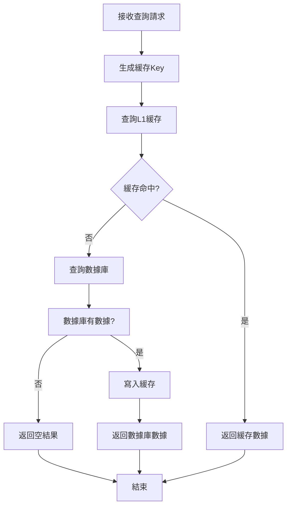
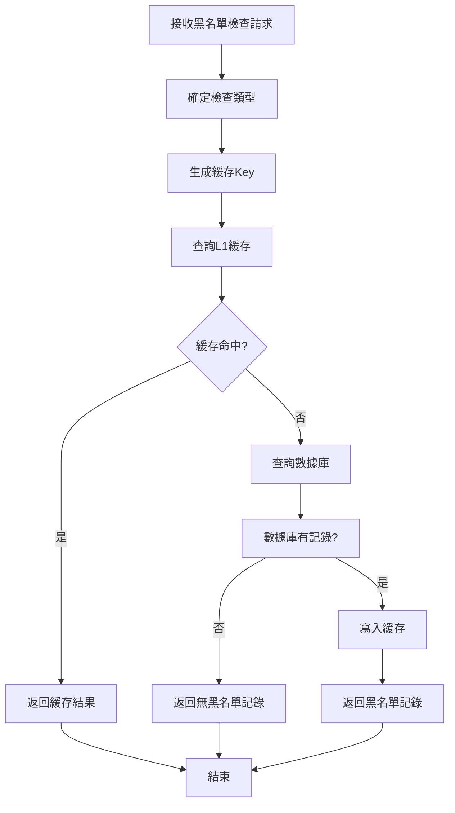

# MultiLevelCache 多級緩存系統

## 📋 項目概述

MultiLevelCache 是一個基於 Spring Boot 的多級緩存系統，專注於提升系統性能和響應速度。該系統採用 Caffeine 作為本地緩存，結合 MySQL 數據庫，實現了高效的數據查詢和緩存管理。

### 🎯 核心特性

- **多級緩存架構**: 採用 L1 緩存（Caffeine）+ 數據庫的兩級緩存模式
- **高性能查詢**: 通過緩存命中大幅提升查詢響應速度
- **智能緩存策略**: 支持緩存過期、容量限制等策略
- **性能監控**: 內建性能測試和監控功能
- **異步處理**: 支持異步任務處理，提升系統吞吐量

## 🏗️ 系統架構

### 技術棧

- **後端框架**: Spring Boot 2.x
- **緩存框架**: Caffeine
- **數據庫**: MySQL 8.0
- **ORM框架**: MyBatis Plus
- **構建工具**: Maven
- **日誌框架**: SLF4J + Logback

### 項目結構

```
MultiLevelCache/
├── src/main/java/com/multilevelcache/
│   ├── aspect/                    # 切面類
│   ├── cache/                     # 緩存服務
│   ├── config/                    # 配置類
│   ├── controller/                # 控制器
│   ├── dto/                       # 數據傳輸對象
│   ├── entity/                    # 實體類
│   ├── mapper/                    # 數據訪問層
│   └── service/                   # 業務服務層
├── src/main/resources/
│   ├── application.yml            # 主配置文件
│   ├── mapper/                    # MyBatis映射文件
│   ├── sql/                       # 數據庫初始化腳本
│   └── static/                    # 靜態資源
└── target/                        # 編譯輸出目錄
```

## 🚀 快速開始

### 環境要求

- JDK 8+
- MySQL 8.0+
- Maven 3.6+

### 安裝步驟

1. **初始化數據庫**
   ```sql
   -- 執行 src/main/resources/sql/init.sql
   ```

2. **配置數據庫連接**
   ```yaml
   # 修改 src/main/resources/application.yml
   spring:
     datasource:
       url: jdbc:mysql://localhost:3306/multilevel_cache
       username: your_username
       password: your_password
   ```

3. **編譯項目**
   ```bash
   mvn clean package
   ```

4. **啟動應用**
   ```bash
   # Windows
   start-app.bat
   
   # 或直接運行
   java -jar target/MultiLevelCache-2.0.0.jar
   ```

### 訪問地址

- **應用首頁**: http://localhost:8080
- **健康檢查**: http://localhost:8080/actuator/health

## 🧪 測試流程說明

### 1. 單元測試

#### 交易記錄查詢測試
```bash
# 測試單個交易記錄查詢
GET /api/transactions/{transactionId}

# 示例
GET /api/transactions/TXN000001
```

#### 黑名單檢查測試
```bash
# 測試用戶黑名單檢查
GET /api/blacklist/user/{userId}

# 測試賬戶黑名單檢查
GET /api/blacklist/account/{accountNumber}

# 示例
GET /api/blacklist/user/USER001
GET /api/blacklist/account/ACC001
```

### 2. 性能測試

#### 交易記錄性能測試
```bash
# 測試交易記錄查詢性能
GET /api/performance/test/transactions?requestCount=100&concurrentThreads=10
```

#### 黑名單性能測試
```bash
# 測試黑名單檢查性能
GET /api/performance/test/blacklist?requestCount=100&concurrentThreads=10
```

#### 綜合性能測試
```bash
# 執行綜合性能測試
GET /api/performance/test/comprehensive?requestCount=50&concurrentThreads=10
```

### 3. 緩存測試

#### 緩存命中率測試
1. 首次查詢：從數據庫獲取數據並寫入緩存
2. 再次查詢：從緩存直接獲取數據
3. 觀察響應時間差異

#### 緩存失效測試
1. 等待緩存過期（配置的TTL時間）
2. 重新查詢驗證緩存失效
3. 確認數據重新從數據庫獲取

## 🔄 核心業務流程

### 1. 交易記錄查詢流程



#### 詳細步驟：

1. **請求接收**: 接收交易ID查詢請求
2. **緩存查詢**: 使用 `transaction:{transactionId}` 作為Key查詢Caffeine緩存
3. **緩存命中**: 如果緩存命中，直接返回數據，響應時間通常在1-5ms
4. **數據庫查詢**: 緩存未命中時，查詢MySQL數據庫
5. **緩存寫入**: 將數據庫查詢結果寫入緩存，設置TTL為30分鐘
6. **結果返回**: 返回查詢結果，包含緩存級別和響應時間信息

### 2. 黑名單檢查流程



#### 詳細步驟：

1. **請求接收**: 接收用戶ID或賬戶號碼的黑名單檢查請求
2. **緩存查詢**: 使用 `user_blacklist:{userId}` 或 `account_blacklist:{accountNumber}` 作為Key
3. **緩存命中**: 如果緩存命中，直接返回黑名單狀態
4. **數據庫查詢**: 緩存未命中時，查詢MySQL黑名單表
5. **緩存寫入**: 將查詢結果寫入緩存，設置TTL為60分鐘
6. **結果返回**: 返回黑名單檢查結果，包含詳細的風險信息

### 3. 緩存管理流程

#### 緩存配置
```yaml
cache:
  caffeine:
    transaction:
      maximum-size: 1000        # 最大緩存條目數
      expire-after-write: 30m   # 寫入後過期時間
      expire-after-access: 10m  # 訪問後過期時間
    blacklist:
      maximum-size: 500         # 最大緩存條目數
      expire-after-write: 60m   # 寫入後過期時間
      expire-after-access: 20m  # 訪問後過期時間
```

#### 緩存操作
- **讀取**: `cacheService.get(cacheName, key, clazz)`
- **寫入**: `cacheService.put(cacheName, key, value)`
- **刪除**: `cacheService.evict(cacheName, key)`
- **清空**: `cacheService.clear(cacheName)`

## 💾 多級緩存應用場景

### 1. 高頻查詢場景

#### 適用場景
- 用戶信息查詢
- 商品信息查詢
- 配置信息查詢
- 黑名單檢查

#### 實現方式
```java
// 查詢流程
public TransactionDTO getTransactionById(String transactionId) {
    String cacheKey = "transaction:" + transactionId;
    
    // 1. 查詢L1緩存
    Transaction cached = cacheService.get(CACHE_NAME, cacheKey, Transaction.class);
    if (cached != null) {
        return buildTransactionDTO(cached, responseTime, "L1", true);
    }
    
    // 2. 查詢數據庫
    Transaction transaction = transactionMapper.selectByTransactionId(transactionId);
    if (transaction != null) {
        // 3. 寫入緩存
        cacheService.put(CACHE_NAME, cacheKey, transaction);
        return buildTransactionDTO(transaction, responseTime, "DB", false);
    }
    
    return buildTransactionDTO(null, responseTime, "DB", false);
}
```

### 2. 讀多寫少場景

#### 適用場景
- 系統配置信息
- 靜態數據查詢
- 參考數據查詢

#### 緩存策略
- **TTL策略**: 設置較長的過期時間（如60分鐘）
- **容量策略**: 限制緩存大小，避免內存溢出
- **更新策略**: 數據變更時主動清除緩存

### 3. 並發高訪問場景

#### 適用場景
- 熱點數據查詢
- 實時數據展示
- 用戶會話信息

#### 性能優化
```java
// 異步緩存更新
@Async("cacheExecutor")
public CompletableFuture<Void> updateCacheAsync(String key, Object value) {
    cacheService.put(CACHE_NAME, key, value);
    return CompletableFuture.completedFuture(null);
}
```

### 4. 數據一致性場景

#### 適用場景
- 金融交易記錄
- 用戶賬戶信息
- 敏感數據查詢

#### 一致性保證
- **緩存失效**: 數據更新時主動清除相關緩存
- **TTL控制**: 設置合理的過期時間
- **數據驗證**: 關鍵數據從數據庫重新驗證

## 📊 性能監控

### 1. 響應時間監控

系統提供詳細的響應時間統計：
- 平均響應時間
- 最小/最大響應時間
- 95%分位數響應時間
- 中位數響應時間

### 2. 緩存命中率監控

通過API響應中的 `fromCache` 字段監控緩存命中率：
- `true`: 數據來自緩存
- `false`: 數據來自數據庫

### 3. 系統健康檢查

```bash
# 健康檢查
GET /actuator/health

# 緩存統計
GET /actuator/caches
```

## 🔧 配置說明

### 數據庫配置
```yaml
spring:
  datasource:
    url: jdbc:mysql://localhost:3306/multilevel_cache
    username: root
    password: your_password
    hikari:
      maximum-pool-size: 10
      minimum-idle: 5
```

### 緩存配置
```yaml
cache:
  caffeine:
    transaction:
      maximum-size: 1000
      expire-after-write: 30m
      expire-after-access: 10m
    blacklist:
      maximum-size: 500
      expire-after-write: 60m
      expire-after-access: 20m
```

### 日誌配置
```yaml
logging:
  level:
    com.multilevelcache: debug
    root: info
```

## 🚨 故障排除

### 常見問題

1. **緩存未生效**
   - 檢查緩存配置是否正確
   - 確認緩存Key生成邏輯
   - 查看日誌中的緩存操作記錄

2. **性能未提升**
   - 檢查緩存命中率
   - 分析響應時間統計
   - 確認數據庫查詢效率

3. **內存使用過高**
   - 調整緩存最大容量
   - 縮短緩存過期時間
   - 監控緩存統計信息

### 調優建議

1. **緩存容量調優**
   - 根據內存使用情況調整 `maximum-size`
   - 監控緩存淘汰統計

2. **過期時間調優**
   - 根據數據更新頻率調整TTL
   - 平衡數據一致性和性能

3. **並發配置調優**
   - 根據系統負載調整線程池大小
   - 監控線程池使用情況

## 📝 更新日誌

### v2.0.0
- 實現多級緩存架構
- 添加性能測試功能
- 完善監控和日誌
- 優化緩存策略

### v1.0.0
- 基礎緩存功能
- 交易記錄查詢
- 黑名單檢查

## 🤝 貢獻指南

1. Fork 項目
2. 創建功能分支
3. 提交變更
4. 發起 Pull Request

## 📄 許可證

本項目採用 MIT 許可證 - 詳見 [LICENSE](LICENSE) 文件

---

**MultiLevelCache Team** - 專注於高性能緩存解決方案 